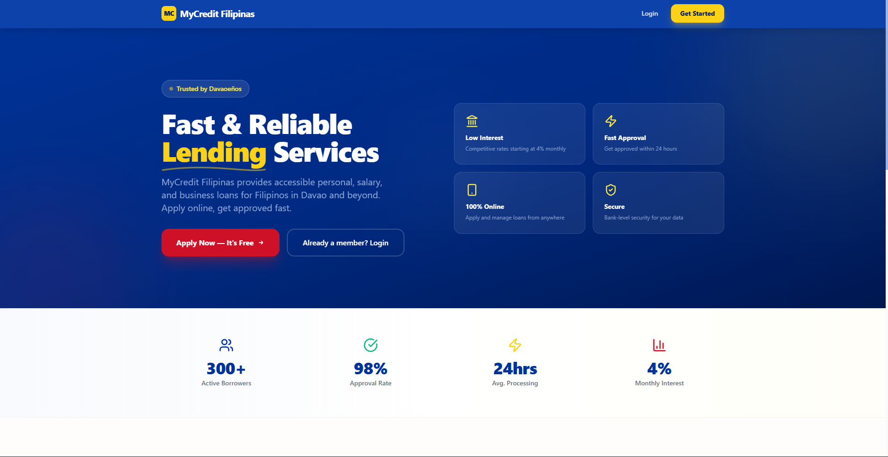

  

<h1 align="center">MyCredit Filipinas</h1>

  A full-stack lending management system for <b>MyCredit Filipinas</b>, a lending company based in Davao City, Philippines.

## Tech Stack

Next.js 16 (App Router) · TypeScript · Tailwind CSS · MySQL/MariaDB · JWT Auth

## Getting Started

1. Clone and install dependencies
2. Create a MySQL database and import the schema
3. Copy `.env.example` to `.env.local` and configure your credentials
4. Run `node seed.js` to populate sample data
5. Run `npm run dev`

## License

Private — MyCredit Filipinas. All rights reserved.
